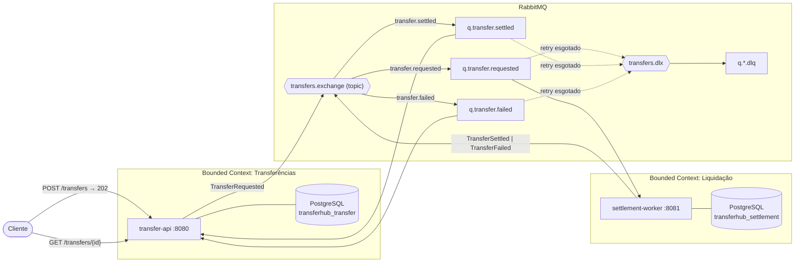

# TransferHub — transferências com liquidação assíncrona

Sistema de transferências entre contas com liquidação assíncrona, construído como dois microsserviços que se comunicam exclusivamente por eventos. Não é um CRUD com fila decorativa: o `settlement-worker` existe porque aplica um **limite diário acumulado por conta destino**, e essa regra exige um histórico de liquidações que é dado dele — por isso ele tem banco próprio. Sem essa regra, seria um serviço a mais sem motivo.


**Stack:** Java 21 · Spring Boot 4.1 · PostgreSQL 17 · RabbitMQ 4 · Flyway · Testcontainers · Docker · Kubernetes (local) · GitHub Actions

## Arquitetura



Cada serviço é dono do seu banco. A comunicação entre eles é **exclusivamente por eventos**.

## Fluxo de uma transferência

1. `POST /api/v1/transfers` exige o header `Idempotency-Key`. Chave ausente → 400. Chave repetida → devolve a transferência já existente com 200, nunca cria duas.
2. Numa única transação de banco: valida as contas, **debita a origem** (com optimistic locking via `@Version` — duas transferências concorrentes na mesma conta não geram lost update) e grava a `Transfer` como `PENDING`.
3. **Depois do commit**, publica `TransferRequested` no RabbitMQ (`@TransactionalEventListener(AFTER_COMMIT)`). Publicar dentro da transação poderia gerar evento para uma transferência que sofreu rollback — um "evento fantasma".
4. A API responde **202 Accepted** + `Location`. A transferência foi aceita, não concluída; o cliente consulta o status via `GET`.
5. O `settlement-worker` consome o evento. Primeiro, idempotência: se já existe `settlement_record` com aquele `transfer_id` (UNIQUE), ignora — mensageria entrega *pelo menos uma vez*.
6. Aplica as regras: valor ≤ 50.000,00 por transação, e soma liquidada para a conta destino nas últimas 24h + valor ≤ 100.000,00 (consulta ao histórico próprio, com índice em `(target_account_id, processed_at)`).
7. Aprovado → grava `SETTLED` e publica `TransferSettled`. Rejeitado → grava `REJECTED` e publica `TransferFailed`. Rejeição por limite é resultado de negócio, não erro do sistema.
8. O `transfer-api` consome `TransferSettled` → credita o destino, status `COMPLETED`.
9. Consome `TransferFailed` → **estorna a origem** (credita de volta o débito do passo 2), status `FAILED` + `failure_reason`. Isso é uma **transação compensatória**: o débito original já commitou em outro processo, não existe rollback distribuído — o que existe é a operação inversa.
10. Os consumers do `transfer-api` são idempotentes por máquina de estados: se o status não é `PENDING`, a mensagem é duplicata e é ignorada — sem crédito nem estorno duplo.

## Decisões e trade-offs

### Por que fila, e não HTTP entre os serviços?
Com HTTP síncrono, o transfer-api ficaria refém da disponibilidade e da latência do worker — e a queda de um derrubaria o outro. Com eventos, o worker pode cair, atualizar ou escalar sem afetar o aceite de transferências: as mensagens ficam na fila esperando. O custo é consistência eventual e todo o trabalho de idempotência descrito acima — que aqui é aceitável, porque liquidação bancária real também não é instantânea.

### Por que dois bancos?
A regra de limite diário precisa do **histórico de liquidações**, e esse dado pertence ao worker. Se ele lesse as tabelas do transfer-api, os dois serviços estariam acoplados pelo schema — qualquer migração num lado quebraria o outro, e "dois serviços" seria só uma fachada. Banco próprio é o que torna a separação real. O custo: nenhuma transação abrange os dois lados, o que leva às compensações.

### Por que 202 Accepted?
Porque é a verdade: o `POST` aceita a transferência, não a conclui. Responder 200/201 mentiria sobre o estado. O 202 + consulta de status é o mesmo modelo de um PIX/TED "em processamento".

### Por que idempotência em três pontos?
Porque cada ponto protege contra um risco diferente: o `Idempotency-Key` na API protege contra retry do **cliente** (rede caiu após o envio); o `transfer_id UNIQUE` no worker protege contra reentrega do **broker** (at-least-once); o `status != PENDING` nos consumers protege contra reentrega dos eventos de resultado. Remover qualquer um deles abre uma janela de duplicação de dinheiro.

### Por que exceção de negócio não faz retry?
Falha de negócio (limite excedido) é **determinística**: reprocessar a mesma mensagem dá o mesmo resultado, então retry só atrasa a resposta. O listener captura `BusinessRuleException` e converte imediatamente em `REJECTED` + `TransferFailed`. Falha **técnica** (banco fora, timeout) é transiente: retry com backoff exponencial (3 tentativas) resolve a maioria; esgotado, a mensagem vai para a DLQ — não pode ser descartada (é dinheiro) nem reenfileirada para sempre (poison loop). Na DLQ, um operador investiga.

### Por que sem Outbox?
Entre o commit do débito e o publish do evento existe uma janela de **dual write**: se o processo morrer exatamente ali, a origem foi debitada e nenhum evento saiu — a transferência fica `PENDING` para sempre. A solução correta é o padrão Outbox (gravar o evento numa tabela na mesma transação e um publisher separado ler e enviar). Escolhi **documentar em vez de implementar**: o Outbox adiciona tabela, publisher, e novos modos de falha, e o objetivo aqui era demonstrar que sei identificar o problema e dimensionar a solução — não inflar o escopo. É a primeira melhoria que eu faria.

### Por que sem Saga orchestrator?
O fluxo é uma **Saga coreografada**: cada serviço reage a eventos, e a compensação (estorno) é disparada pelo evento de falha. Um orquestrador central se justifica quando há muitos passos e ramificações — para 2 serviços e 3 eventos, seria um componente a mais para falhar, sem ganho. O trade-off honesto: coreografia distribui a lógica do fluxo (ninguém "enxerga" a saga inteira num lugar só), o que em fluxos maiores pesa a favor do orquestrador.

## Limitações conhecidas

- **Janela de dual write** entre o commit e o publish (ver "Por que sem Outbox").
- **Não há endpoint de depósito**: contas nascem com saldo zero e o saldo inicial é semeado via SQL. Decisão de escopo — o domínio demonstrado é transferência, não gestão de conta.
- **Retry in-memory**: as tentativas de reprocessamento não sobrevivem a restart do consumer (a mensagem volta à fila, mas o contador zera). Retry via broker (TTL + DLX) resolveria, com topologia mais complexa.
- **Corrida rara no Idempotency-Key**: duas requisições simultâneas com a mesma chave → a segunda recebe 409 (o UNIQUE impede a duplicata) em vez de 200 com a transferência existente.
- **HPA por CPU** é proxy imperfeito para backlog de fila; o correto seria KEDA com trigger de profundidade da fila.
- **Secret do Kubernetes é base64, não criptografia** — aceitável só porque o escopo é cluster local; produção pediria External Secrets/Vault.
- **Contrato de eventos duplicado por cópia** em cada serviço (sem jar compartilhado, por desacoplamento); a compatibilidade é protegida por testes de contrato que pinam os nomes dos campos JSON.

## Como rodar

Pré-requisitos: Docker + Docker Compose.

```bash
docker compose up --build
```

| Serviço | URL |
|---|---|
| transfer-api | http://localhost:8080 |
| settlement-worker | http://localhost:8081 |
| RabbitMQ Management | http://localhost:15672 (guest/guest) |

### Testando o fluxo

```bash
# 1. Criar duas contas
curl -s -X POST localhost:8080/api/v1/accounts -H 'Content-Type: application/json' \
  -d '{"document":"11111111111","holderName":"Alice"}'
curl -s -X POST localhost:8080/api/v1/accounts -H 'Content-Type: application/json' \
  -d '{"document":"22222222222","holderName":"Bob"}'

# 2. Semear saldo da origem (não há endpoint de depósito — limitação documentada)
docker exec postgres-transfer psql -U transfer -d transferhub_transfer \
  -c "UPDATE accounts SET balance=100000 WHERE document='11111111111';"

# 3. Transferir (Idempotency-Key é obrigatório) → 202 Accepted
curl -s -X POST localhost:8080/api/v1/transfers \
  -H 'Content-Type: application/json' -H 'Idempotency-Key: demo-1' \
  -d '{"sourceAccountId":"<id-alice>","targetAccountId":"<id-bob>","amount":500.00}'

# 4. Consultar o status até COMPLETED (ou FAILED, com o motivo)
curl -s localhost:8080/api/v1/transfers/<transfer-id>

# Cenário de rejeição: repita o passo 3 com "amount": 60000.00 (> limite de 50k)
# e acompanhe o status virar FAILED com o estorno na conta de origem.
```

### Testes

```bash
# Cada módulo: unitários + integração (Testcontainers sobe Postgres e RabbitMQ reais)
cd transfer-api && mvn verify
cd settlement-worker && mvn verify
```

## Kubernetes (ambiente local — kind/minikube)

> Os manifests em `k8s/` foram escritos e validados para **ambiente local**
> (kind/minikube). Não representam uma instalação de produção — as ressalvas
> (Secret em texto, infra com emptyDir, HPA por CPU) estão comentadas nos
> próprios manifests.

```bash
kind create cluster
docker compose build
kind load docker-image microservice-transferhub-transfer-api:latest
kind load docker-image microservice-transferhub-settlement-worker:latest
kubectl apply -f k8s/secret.yaml -f k8s/configmap.yaml -f k8s/infra/
kubectl apply -f k8s/
kubectl port-forward svc/transfer-api 8080:8080
```

Os probes usam a separação liveness/readiness do Actuator: liveness não inclui
dependências externas (reiniciar o pod não conserta o banco); readiness inclui
`db` e `rabbit` — dependência fora do ar tira o pod do balanceador sem reiniciá-lo.

## CI

Cada push/PR roda `mvn verify` nos dois módulos — incluindo os testes de
integração com Testcontainers no próprio runner. Push na `main` publica as
imagens no GHCR com as tags `latest` e o SHA do commit (rastreabilidade e
rollback preciso).
